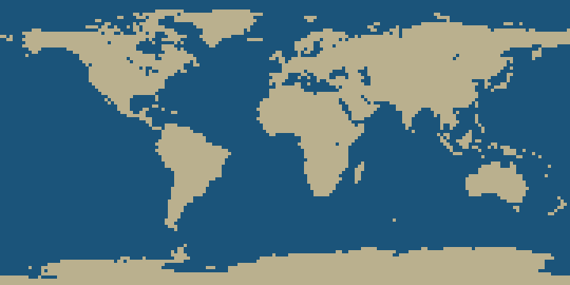

# Shoreline

Ask a model **land or water**, give it a latitude and longitude, and score the answer against a public-domain atlas.

A 2° grid is 90 × 180 = **16,200** places. Shoreline is that grid, an atlas tile for each place, and a reinforcement-learning loop on top. Episodes run in-process, behind an [OpenEnv](https://github.com/huggingface/OpenEnv) server, or as a GRPO training job on a single GPU.



## What you can train

**Survey.** One step. The observation is the question and a map tile centered on the coordinate. The reply is free text. Reward is 1 when the last `land` or `water` in the reply matches the cell, and 0 otherwise. The label is not in the prompt.

**Coast.** The agent starts inland. It may answer `north`, `south`, `east`, or `west`, or `here` when it believes it is on the shoreline. `here` on the coast scores 1. Anything else that ends the episode scores 0.

**Locate.** The agent is dropped on a hidden place. It sees an atlas sketch and a map tile. The latitude and longitude are not in the prompt. It can look `north`, `south`, `east`, or `west`, then commit with two numbers. The reward falls with kilometres of error, and each look costs a little.

Training samples land and water evenly, because a model that always says "water" is right on about two thirds of a uniform lat/lon grid.

## Map tiles

The tiles are drawn from [Natural Earth](https://www.naturalearthdata.com/) 1:110m land and lake outlines, which are in the public domain. Lakes such as the Caspian and the Great Lakes are water. The raster is 0.25°. A harbor on that simplified coastline can fall in the neighboring cell.

The picture is an atlas tile rendered in this repo: water, land, a pale shoreline, and a crosshair on the coordinate.

## Install

```bash
pip install -e ".[dev]"
pytest
```

The land mask ships in `shoreline/data/land_mask.npz`. Rebuild it with:

```bash
python -m shoreline.build_mask
```

## Look at one place

```bash
python -m shoreline.demo --lat 48.86 --lon 2.35 --answer land
```

That prints the prompt, writes `shore-tile.png`, and scores the answer.

```python
from shoreline.sim import ShoreSim

sim = ShoreSim()
first = sim.reset(latitude=48.86, longitude=2.35)
print(first.prompt)
scored = sim.step("Land")
print(scored.reward)
```

## Plot the 16,200 cells

```bash
python -m shoreline.plot --out docs/earth.png
```

To ask a local OpenAI-compatible server:

```bash
python -m shoreline.plot --base-url http://127.0.0.1:8080/v1 --step 10 --out outputs/model.png
```

`--step 2` is the full 16,200 questions. The command stops above 400 questions unless you pass `--yes`, because a local model can take a long time to answer the whole planet. The picture has three panels: the true globe, the model's globe, and the misses in red.

## Train

The default job is a 0.5B model with a small LoRA and four short answers per step. A free T4, on Colab or on Kaggle, has enough memory.

**Colab.** Runtime → Change runtime type → T4 GPU. Upload this folder, or keep it in Google Drive, and run `notebooks/colab_grpo.ipynb`. The adapter is saved to `/content/shoreline-adapter`, with a checkpoint every 5 steps.

**Kaggle.** Upload this folder as a dataset, turn on a GPU accelerator, and run `notebooks/kaggle_grpo.ipynb`.

Both notebooks find the repo, show a tile, print how often "always water" would win, then run GRPO. The loop is in `shoreline/grpo.py`. It fine-tunes a LoRA adapter on `Qwen/Qwen2.5-0.5B-Instruct` by default. Each step samples four answers to one balanced coordinate, scores them in the simulator, and updates from the group advantage.

```bash
pip install -e ".[train]"
python -m shoreline.sft
python -m shoreline.grpo --steps 20
python -m shoreline.grpo --task locate --steps 20
```

`python -m shoreline.sft` fits a LoRA so the reply is the word the atlas would mark correct. On a T4, 400 steps of eight places each produced the adapter published with this project. On 200 fresh balanced places it scored 75.5 percent (61 percent of land, 92 percent of water). Before training, the same prompt scored 47 percent and almost never said land. On 200 places drawn uniformly, the trained adapter scored 81.5 percent.

The live demo and the write-up are on the [Shoreline space](https://huggingface.co/spaces/vanishingradient/shoreline). The weights are [vanishingradient/shoreline-land-water](https://huggingface.co/vanishingradient/shoreline-land-water).

## OpenEnv server

```bash
pip install -e ".[openenv]"
python -m shoreline.server.app --port 8000
```

```python
from shoreline.client import ShoreEnv
from shoreline.models import ShoreAction

with ShoreEnv(base_url="http://127.0.0.1:8000").sync() as env:
    result = env.reset()
    result = env.step(ShoreAction(text="land"))
    print(result.reward, result.observation.prompt)
```

`reset` accepts `task` (`survey` or `coast`), `latitude`, `longitude`, `seed`, and `balance`. Docker:

```bash
docker build -t shoreline .
docker run --rm -p 8000:8000 shoreline
```

The simulator does not import OpenEnv.

## Project layout

| Path | Role |
| --- | --- |
| `shoreline/sim.py` | Episodes, reward, prompts |
| `shoreline/world.py` | Land mask and atlas tiles |
| `shoreline/environment.py` | OpenEnv adapter |
| `shoreline/grpo.py` | Group Relative Policy Optimization |
| `shoreline/plot.py` | The 16,200-cell figure |
| `notebooks/colab_grpo.ipynb` | Colab free T4 training notebook |
| `notebooks/kaggle_grpo.ipynb` | Kaggle training notebook |

## License

Code is MIT. See `LICENSE`. The coastline data is Natural Earth, public domain. See `shoreline/data/README.md`.
